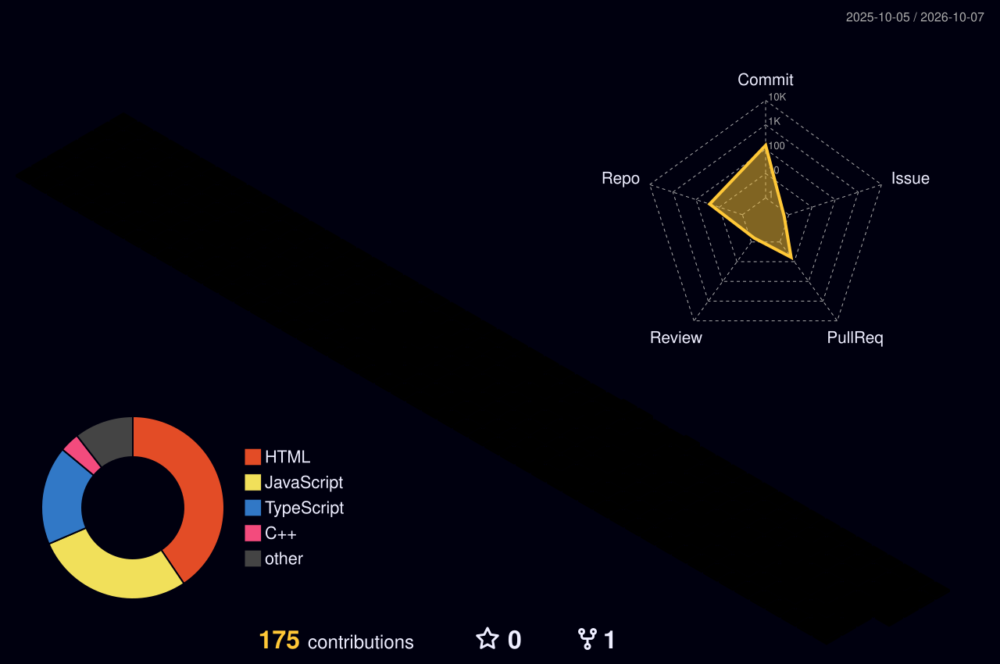

<!--
╔══════════════════════════════════════════════════════════════════════╗
║  ADITYA KUMAR SHARMA • PREMIUM PROFILE README                    ║
║  Aurora / 3D / Dark Tech aesthetic                                ║
╚══════════════════════════════════════════════════════════════════════╝
-->


<div align="center">

# `>_` Hi, I'm **Aditya** 👋

### Building ideas into products • Learning by doing • Exploring what comes next


<br/>

<a href="https://github.com/adityakumarsharma7398-cyber">

</a>
<a href="https://www.linkedin.com/in/aditya-kumar-sharma-85a0782bb">

</a>
<a href="https://protfolio-task1.netlify.app/">

</a>

<br/><br/>


&nbsp;

&nbsp;


</div>

---

## ◈ `about.exe`

<table>
<tr>
<td width="62%" valign="top">

I'm **Aditya Kumar Sharma**, a Computer Science student who enjoys turning ideas into working software.

My current journey sits at the intersection of **Web Development and AI/ML**. I like building interfaces, connecting APIs and databases, experimenting with AI-powered features, and learning the fundamentals behind the tools I use.

I prefer **building over just consuming tutorials** — every project is an opportunity to understand something better.

### ⚡ Current focus

- 🌐 Full-stack web development
- 🤖 AI/ML & Generative AI
- 🧠 DSA & problem solving
- 🗄️ Databases, APIs & backend systems
- ☁️ Cloud and deployment
- 🏆 Hackathons, projects & technical communities

</td>

<td width="38%" align="center" valign="middle">

```text
┌──────────────────────┐
│   SYSTEM STATUS      │
├──────────────────────┤
│  WEB       ███████░  │
│  AI / ML   ██████░░  │
│  DSA       █████░░░  │
│  CLOUD     ████░░░░  │
│  BUILDING  ████████  │
└──────────────────────┘
```


</td>
</tr>
</table>

> **Build → Break → Debug → Learn → Ship → Repeat.**

---

## ◈ `tech_stack`

<div align="center">

### 🧬 Languages


### 🌐 Web


### 🗄️ Data & Backend


### 🤖 AI / ML


### ☁️ Cloud & Tools


</div>

---

## ◈ `what_i_build`

<div align="center">

<table>
<tr>
<td align="center" width="33%">

### 🌐 WEB
**Interfaces**

Responsive experiences  
APIs & backend logic  
Database-driven apps

</td>
<td align="center" width="33%">

### 🤖 AI
**Intelligence**

AI-powered features  
Automation  
GenAI experiments

</td>
<td align="center" width="33%">

### 🏆 BUILD
**Hackathons**

Rapid prototypes  
Real-world problems  
Team collaboration

</td>
</tr>
</table>

</div>

---

## ◈ `featured_work`

### 🩸 LifeLink
**Blood-bank connectivity & management platform**

A project focused on connecting blood-bank operations, inventory workflows and people through a modern web experience.

`TypeScript` `React` `Supabase` `AI/ML` `Full Stack`

### 🧠 AI / Product Experiments

I also experiment with ideas around **AI-powered verification, intelligent automation, developer tools and practical problem-solving** — turning concepts into prototypes instead of leaving them as ideas.

> 🚧 More projects are continuously being built and refined.

---

## ◈ `3D contribution universe`

<div align="center">



</div>

> A contribution calendar rendered as a 3D visual — generated automatically with GitHub Actions.

---

## ◈ `github telemetry`

<div align="center">

### 🔥 Contribution Streak


<br/><br/>

### 📊 Profile Overview


<br/><br/>


</div>

---

## ◈ `contribution_snake`

<div align="center">

<picture>
  <source media="(prefers-color-scheme: dark)" srcset="https://raw.githubusercontent.com/adityakumarsharma7398-cyber/adityakumarsharma7398-cyber/output/github-snake-dark.svg"/>
  <source media="(prefers-color-scheme: light)" srcset="https://raw.githubusercontent.com/adityakumarsharma7398-cyber/adityakumarsharma7398-cyber/output/github-snake.svg"/>
  
</picture>

</div>

---

## ◈ `connect()`

<div align="center">

<a href="https://github.com/adityakumarsharma7398-cyber">

</a>
<a href="https://www.linkedin.com/in/aditya-kumar-sharma-85a0782bb">

</a>
<a href="https://protfolio-task1.netlify.app/">

</a>

<br/><br/>


</div>

---

<div align="center">

### `console.log("Keep building.")`

<br/>


</div>
